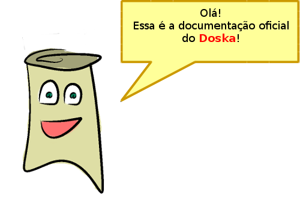
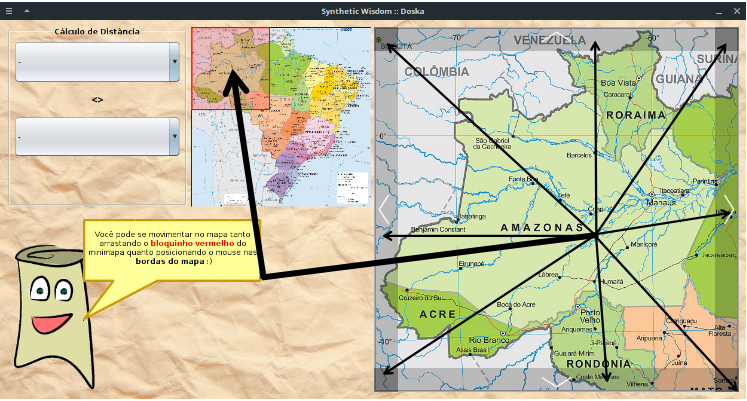
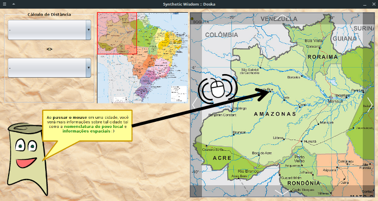
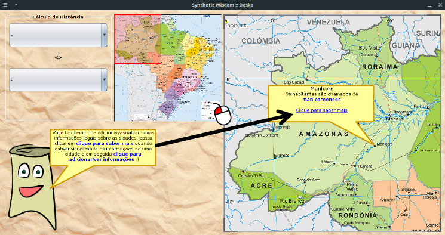
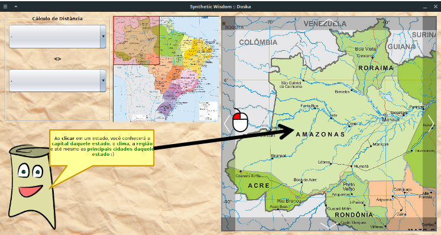
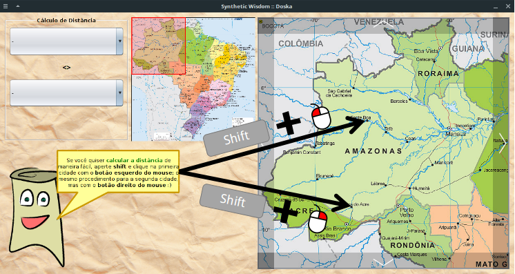
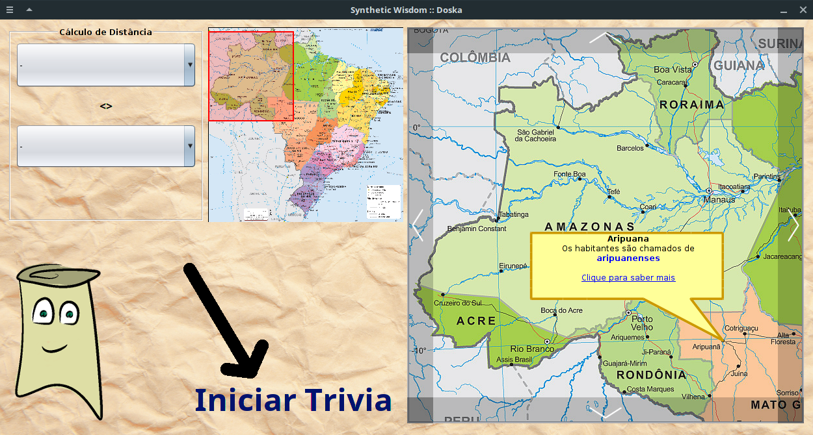
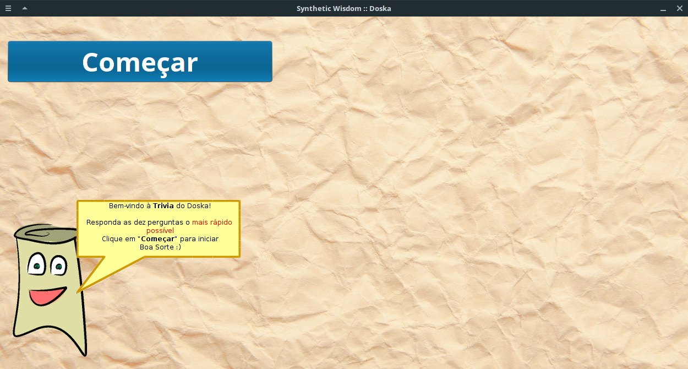
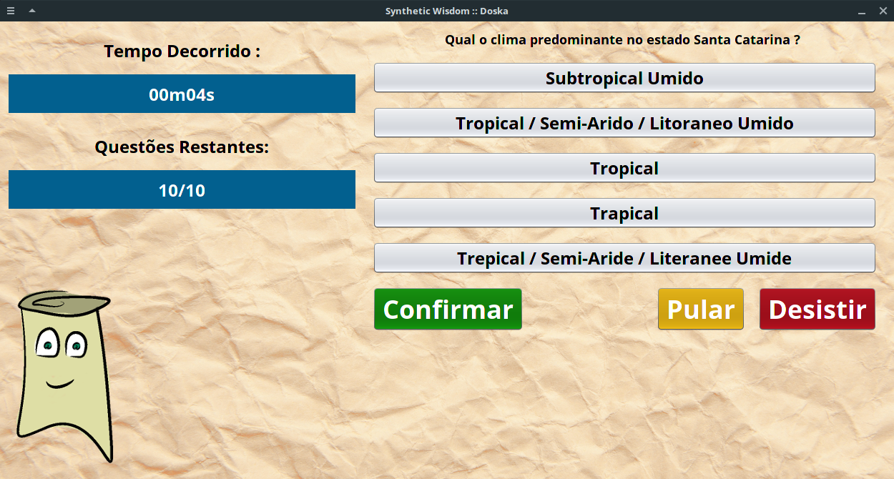
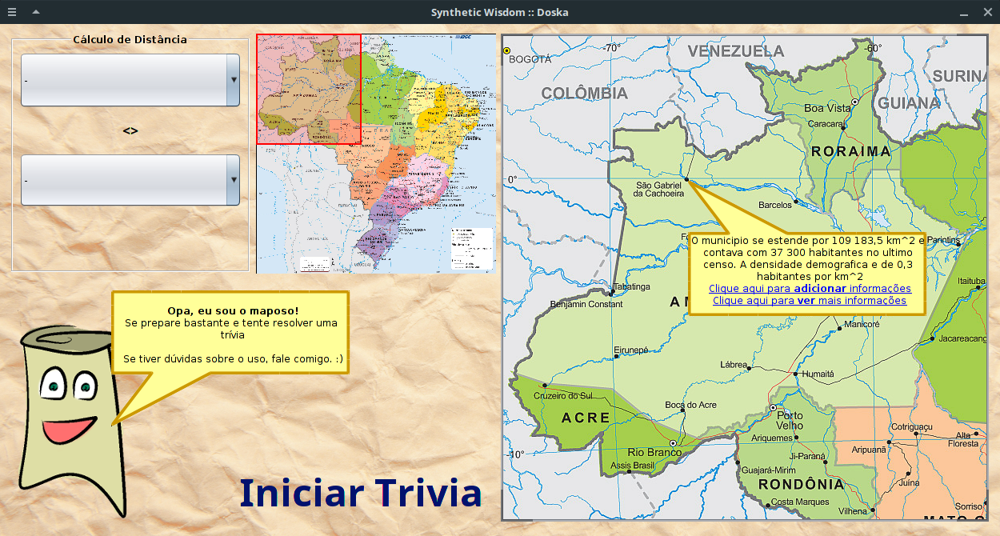

# Doska
###### sYnthetic Wisdom

<p align='right'>Ruan Gabriel Gato Barros</p>



---

# Conteúdo
1. [Introdução](#introdução) - _uma pequena introdução ao Doska._
2. [Requisitos](#requisitos) - _diz respeito aos requisitos necessários para executar o programa._
3. [Utilização](#utilização) - _diz respeito à forma de utilizar o programa._
    - 3.1 [Execução](#execução) - _diz respeito à forma de executar o programa._
    - 3.2 [Funções](#funções) - _diz respeito às principais funções do programa._
4. [Adicionar Informações](#adicionar-informações) - _diz respeito às formas de agregar conhecimento ao programa._

---

# Introdução
**Mas afinal, o que é o Doska?**

Doska é  pequeno software com o objetivo de proporcionar algumas informações acerca da geografia do Brasil de maneira interativa.

Utiliza uma base de conhecimento pré-recolhida sendo manipulada por meio da linguagem PROLOG, sendo possível adicionar novos fatos na base de dados.
## 

---

# Requisitos

JDK ao menos na versão **1.8.0_131**

O programa foi desenvolvido no seguinte ambiente : 

```
openjdk version "1.8.0_131"
OpenJDK Runtime Environment (build 1.8.0_131-8u131-b11-2ubuntu1.16.04.3-b11)
OpenJDK 64-Bit Server VM (build 25.131-b11, mixed mode)
```

---

# Utilização

## Execução

É recomendado que a execução do programa seja feita pela linha de comando, uma vez que, em alguns sistemas, o diretório de execução do `.jar` não é o mesmo da pasta atual, sendo necessário adicioná-la ao path.

  - **Pela linha de comando**

No diretório do programa, execute o seguinte comando : 

  ```
  java -jar /dist/SyntheticWisdom-Doska.jar
  ```
  
  - **Pelo próprio `.jar`**

No diretório do programa, navegue para a pasta `./dist` e execute o executável `SyntheticWisdom-Doska.jar`

## Funções

  - **Movimentação** - é possível se movimentar pelo mapa tanto arrastando o quadrado vermelho do minimapa quanto movendo o mouse pelas bordas do mapa grande, como é visto abaixo : 

  

  - **Informações sobre Cidades** - é possível verificar algumas informações relativas à cidade (como _nomenclatura do povo local_, _extensão territorial_ e _demografia_) que você desejar somente movendo o mouse em cima da cidade desejada; para informações adicionais, clicar em `Clique para saber mais`. 

  
  

  - **Informações sobre Estados** - é possível adquirir algumas informações sobre o estado somente clicando nele. As informações adquiridas são : o nome da cidade capital, o clima predominante no estado e a região a qual o estado pertence, além de conseguir visualizar o nome das principais cidades daquele estado.

  

  - **Informações entre duas cidades** - como feature adicional, é possível calcular a distância entre duas cidades seguindo o procedimento abaixo : 

  

  - **Trivia** - a feature principal do Doska, o modo Trivia possibilita o utilizador testar seus aprendizados em uma espécie de jogo de perguntas e respostas. É possível entrar no modo trivia clicando em `Iniciar Trivia` como mostrado abaixo :

  

  Uma vez no modo trivia, você se deparará com o Maposo indicando que você deve clicar em `Começar`.

  

  Após clicar em `Começar`, você se deparará com um conjunto de perguntas e algumas alternativas e deverá responder todas.
  
  

  **Obs** : é possível pular perguntas no modo Trivia clicando em `Pular`, também é possível desistir do jogo atual clicando em `Desistir`, mas isso não é nem um pouco recomendado.

---

# Adicionar Informações

O programa conta com um pequeno módulo para adicionar informações de usuário, tal módulo pode ser acessado ao clicar em uma cidade e clicar em `Clique para saber mais`, após isso, clicar em `Clique aqui para adicionar informações`, então, uma caixa de texto irá pedir a informação adicional à ser acessada. Tal informação será armazenada no banco de dados e será mantida nas próximas execuções.



Outra forma de adicionar conhecimento é utilizar o próprio arquivo de conhecimentos `Knowledge.sw` e adicionar informações nas seguintes categorias de fatos : 

  - `internal_STATE_REGION` - used for keep the regions of the states.  
  - `internal_CAPITAL_OF` - used for keep the `belonging` information regarding capital-state.
  - `internal_CITIES_BY_STATE` - used for keep the main cities list for state.
  - `internal_MAP_LOCATION` - used for keep the cities location on the internal map in the program.  
  - `internal_CITY_POINT` - used for keep the points of the cities so the distance between two cities can be calculated.
  - `internal_CITIZEN_CALLED` - used for keep the name os the citizen on each city.
  - `internal_CLIMATE_BY_STATE` - used for keep the climate information on all the states.
  - `internal_FURTHER_INFORMATIONS` - used for keep further informations about a city.
  - `internal_USER_FURTHER_INFORMATIONS` - used for keep further information the people who use the program will add.