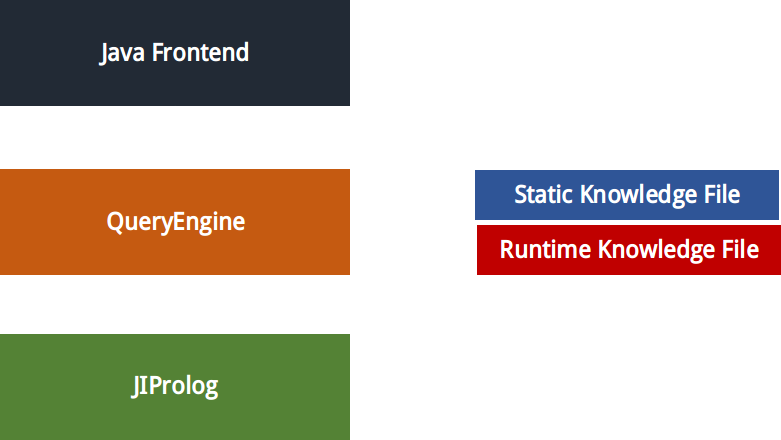
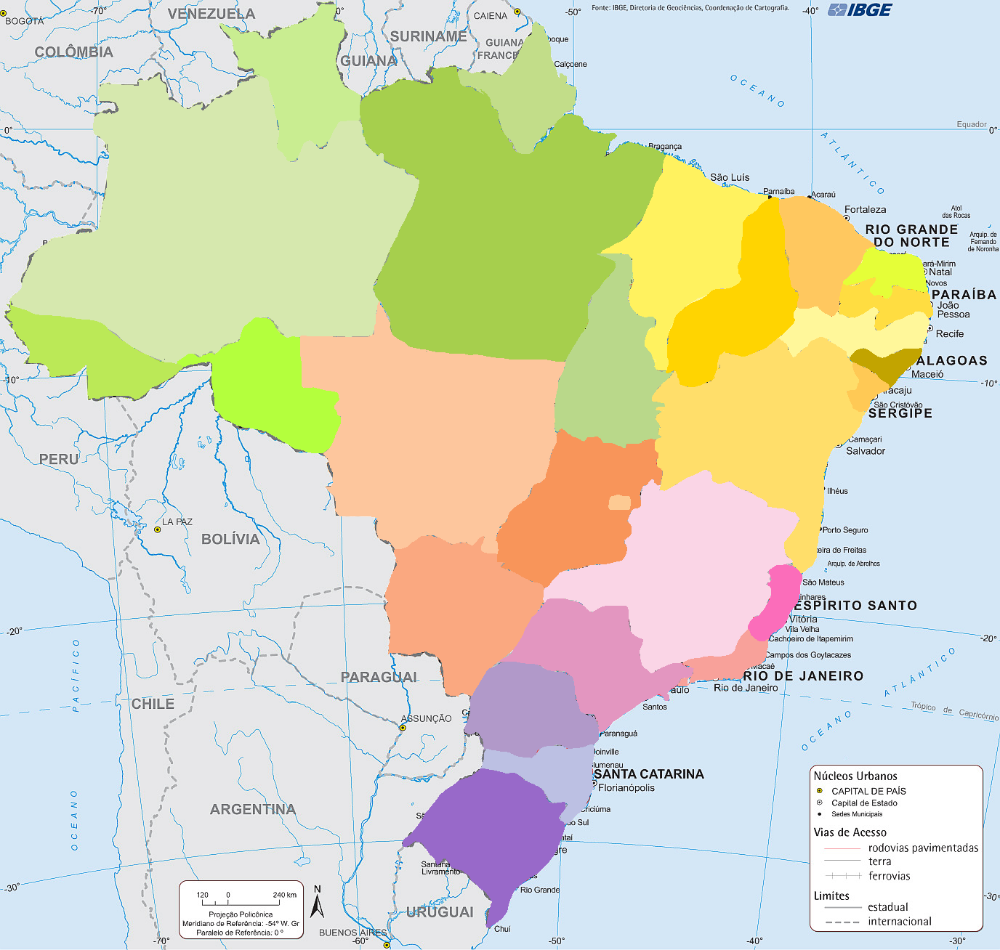

# sYntheticWisdom-Doska

Doska is a simple java program made for help people studying Brazil Geography.

It counts on an simple interface to retrieve information about some topics and a special module called `Trivia` , whose objective is to test the people's abilities.

# Modules

## Java + JIProlog

This implementation of prolog is used within the code as a engine to retrieve information and keep the informations about the program UI.

## Database
  
  - `internal_STATE_COLOR` - used for keep the state colors; it helps on the on-click-recognition on each state by its color spectrum as seen below : 

  

  - `internal_STATE_REGION` - used for keep the regions of the states.
  
  - `internal_CAPITAL_OF` - used for keep the `belonging` information regarding capital-state.

  - `internal_CITIES_BY_STATE` - used for keep the main cities list for state.
   
  - `internal_MAP_LOCATION` - used for keep the cities location on the internal map in the program.
  
  - `internal_CITY_POINT` - used for keep the points of the cities so the distance between two cities can be calculated.
  
  - `internal_CITIZEN_CALLED` - used for keep the name os the citizen on each city.
  
  - `internal_CLIMATE_BY_STATE` - used for keep the climate information on all the states.
  
  - `internal_FURTHER_INFORMATIONS` - used for keep further informations about a city.
  
  - `internal_USER_FURTHER_INFORMATIONS` - used for keep further information the people who use the program will add.

